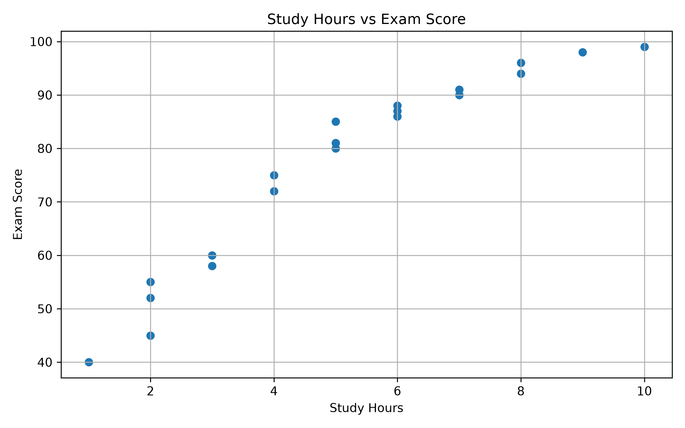
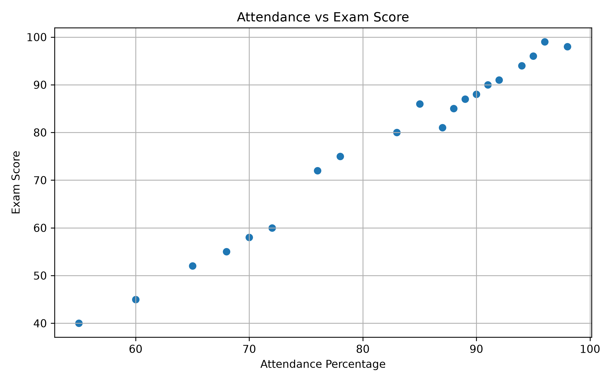
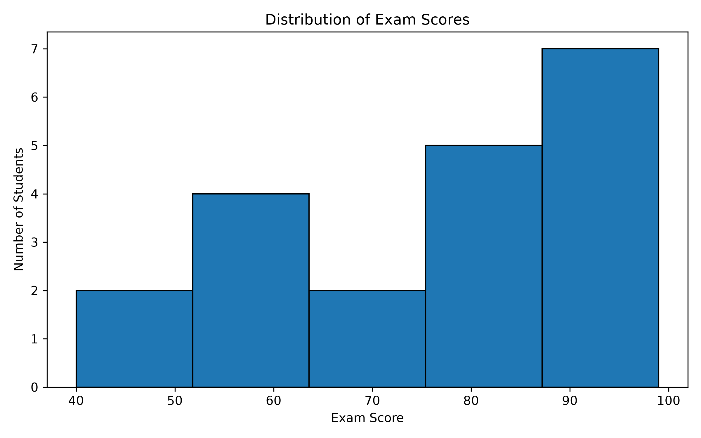
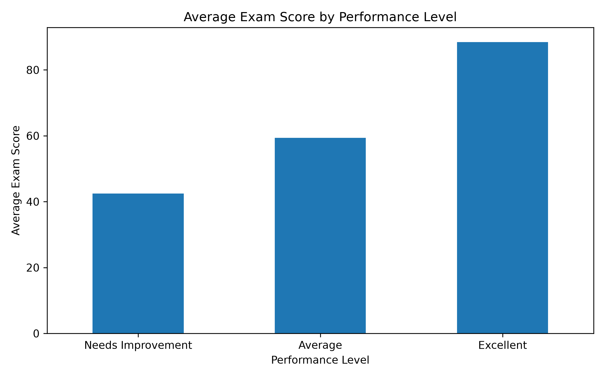

# CodeAlpha Internship Tasks – Data Analytics

## Student Performance Analysis

This project was completed as part of the CodeAlpha Data Analytics Internship.

The project focuses on analyzing student performance data using Exploratory Data Analysis (EDA) and Data Visualization techniques.

## Project Objectives

- Understand the student performance dataset.
- Perform basic data exploration and statistical analysis.
- Check missing values and dataset information.
- Analyze relationships between study hours, attendance, assignments, and exam scores.
- Identify high-performing students.
- Create meaningful visualizations from the dataset.

## Dataset

The dataset contains student academic performance information.

### Main Features

- Student_ID
- Study_Hours
- Attendance_Percentage
- Assignment_Score
- Exam_Score

The dataset contains 20 student records.

## Technologies Used

- Python
- Pandas
- Matplotlib
- VS Code
- GitHub

## Exploratory Data Analysis

The following EDA techniques were performed:

- Displayed the first five records.
- Checked dataset information.
- Checked for missing values.
- Generated statistical summary.
- Calculated average study hours.
- Calculated average attendance.
- Calculated average exam score.
- Performed correlation analysis.
- Identified the top 5 students based on exam score.

## Data Visualizations

### 1. Study Hours vs Exam Score

A scatter plot was created to examine the relationship between study hours and exam scores.



### 2. Attendance vs Exam Score

A scatter plot was created to analyze the relationship between attendance percentage and exam scores.



### 3. Distribution of Exam Scores

A histogram was used to understand the distribution of students' exam scores.



### 4. Average Exam Score by Performance Level

Students were grouped into three performance levels:

- Needs Improvement
- Average
- Excellent

The average exam score for each performance level was visualized using a bar chart.



## Key Findings

- Study hours show a strong positive relationship with exam scores in this dataset.
- Attendance percentage also shows a strong positive relationship with exam scores.
- Students with higher study hours generally achieved higher exam scores.
- The highest exam score in the dataset is 99.
- The dataset contains no missing values.
- The top-performing students have high study hours, attendance, and assignment scores.

## How to Run the Project

1. Install Python.
2. Install the required libraries:

```bash
pip install pandas matplotlib
